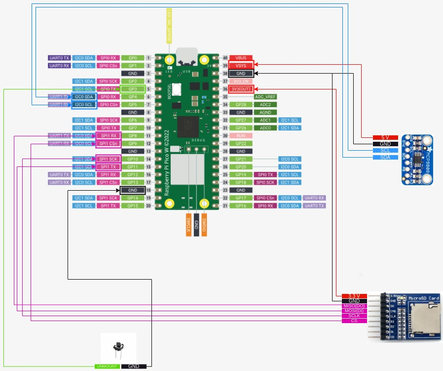
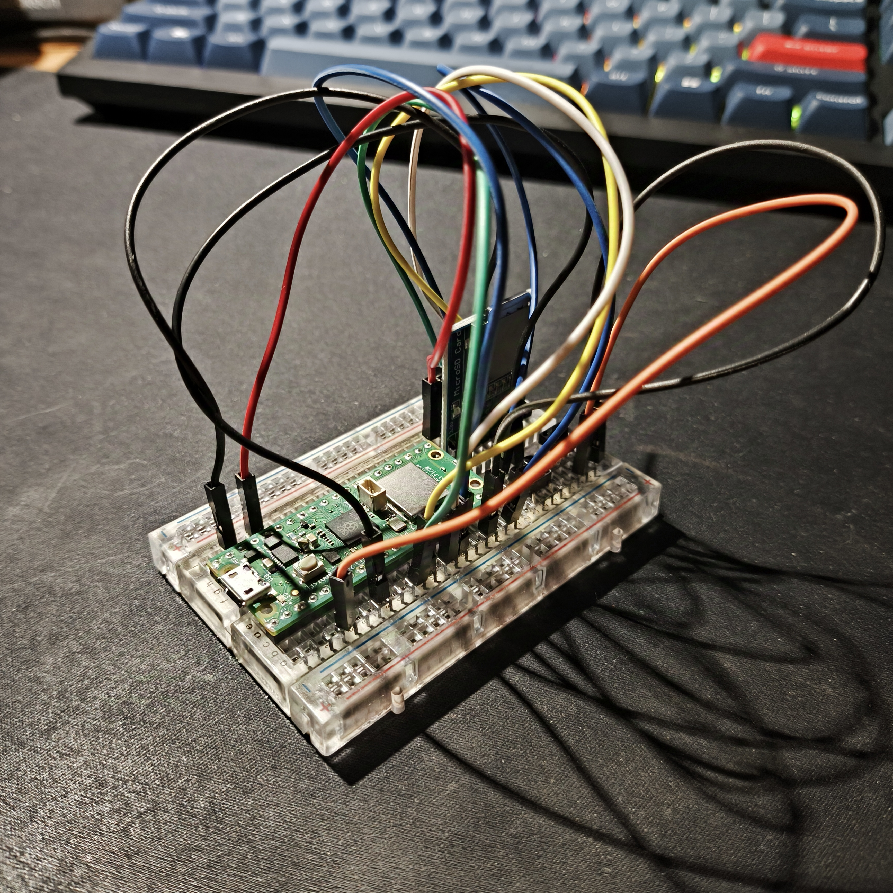

# Wireless Temperature Logging with RPi Pico W
## Introduction
This project showcases a wireless temperature logging system, built using two 
Raspberry Pi Pico W microcontrollers. It invlolves sending and receiving 
messages via the UDP protocol, as well as using a FAT32 filesystem to store 
temperature data on SD cards. 
## Components Used
The components used for this project were:
* 2 Raspberry Pi Pico W Microcontrollers
* 3 Breadboards (One smaller for the temperature sensor)
* 3 Push buttons
* 2 Waveshare Micro SD Storage Boards
* 2 Transcend 300S MicroSD 4GB Cards
* 1 Adafruit MCP9808 Temperature Sensor
* Jumper Wires
## Implementation
The main idea is that the temperature sensor is connected on the Access Point 
Pico, and the Station Pico controls when values of the temperature are logged 
with the press of a button. When the button is pressed, the Access Point is 
triggered to:
* Measure the ambient temperature.
* Log the data to an SD card.
* Send the temperature data back to the Station.

The Station receives the data and also saves them on its own SD card.

Both the Access Point and the Station Pico have a button connected, which is 
responsible for unmounting the filesystem (both on GPIO pin 3). When it's 
pressed, the filesystem is no longer in use. I added this button as a way to 
have a safe termination of the program. 
## Images
Below I attached images of the station and the access point layouts.
<figure>
    
    <figcaption> Access Point Layout </figcaption>
</figure>

<figure>
    
    <figcaption> Station Layout </figcaption>
</figure>

## Binaries Folder
In case you are not interested in building the project, both the .uf2 and .elf files are included in the "bin" folder, where they can be simply loaded on 2 Pico W boards.