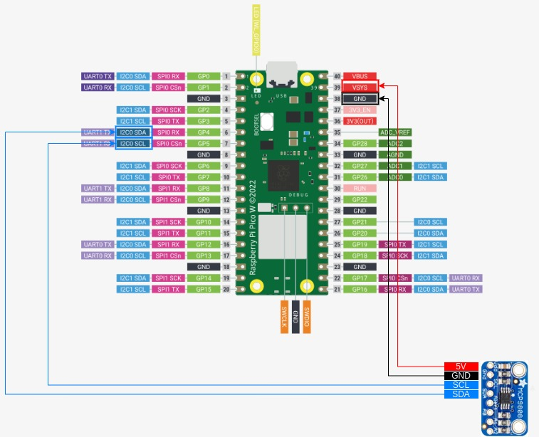
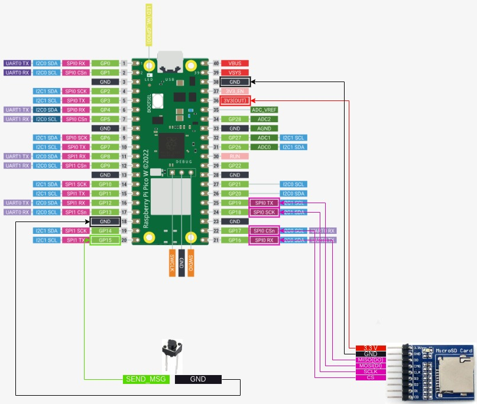

# Wireless Temperature Logging with RPi Pico W
## Introduction
This project showcases a wireless temperature logging system, built using two 
Raspberry Pi Pico W microcontrollers. It invlolves sending and receiving 
messages via the UDP protocol, as well as using a FAT32 filesystem to store 
temperature data on SD cards. 
## Components Used
The components used for this project were:
* 2 Raspberry Pi Pico W Microcontrollers
* 3 Breadboards (One smaller for the temperature sensor)
* 3 Push buttons
* 2 Waveshare Micro SD Storage Boards
* 2 Transcend 300S MicroSD 4GB Cards
* 1 Adafruit MCP9808 Temperature Sensor
* Jumper Wires
## Implementation
The main idea is that the temperature sensor is connected on the Access Point 
Pico, and the Station Pico controls when values of the temperature are logged 
with the press of a button. When the button is pressed, the Access Point is 
triggered to:
* Measure the ambient temperature.
* Log the data to an SD card.
* Send the temperature data back to the Station.

The Station receives the data and also saves them on its own SD card.

Both the Access Point and the Station Pico have a button connected, which is 
responsible for unmounting the filesystem (both on GPIO pin 3). When it's 
pressed, the filesystem is no longer in use. I added this button as a safety 
measure against data corruption (similar to how we "eject" a USB stick when 
using a computer).
## Images
Below I attached images of the station and the access point layouts. To make 
more sense of the wiring see the corresponding tables. I will only add the 
used pins in the tables.
<figure>
    
    <figcaption> Access Point Layout </figcaption>
</figure>

| 2 Pin Button (Unmount) | MCP9808 Temperature Sensor | SD Card Breakout Board |  Pin on Pico (Access Point) |
| :----------: | :------------------------: | :--------------------: | :-------------------------: |
| First Pin | - | - | GPIO Pin 3 |
| Second Pin| - | - | Physical Pin 18 (or any GND pin) |
| - | Vcc | - | VSYS (Physical Pin 39) |
| - | GND | - | Physical Pin 38 (or any GND pin) |
| - | SCL | - | I2C0 SCL (Physical Pin 7) |
| - | SDA | - | I2C0 SDA (Physical Pin 6) |
| - | - | 3.3V | 3.3V(OUT) |
| - | - | GND | Physical Pin 38 (or any GND pin) |
| - | - | MISO(DO) | SPI1 RX (Physical Pin 11) |
| - | - | MOSI(DI) | SPI1 RT (Physical Pin 15) |
| - | - | SCLK | SPI1 SCK (Physical Pin 14) |
| - | - | CS | SPI1 CSn (Physical Pin 12) |

<figure>
    
    <figcaption> Station Layout </figcaption>
</figure>

| 2 Pin Button (Unmount) | 2 Pin Button (Send Message) | SD Card Breakout Board |  Pin on Pico (Station) |
| :----------: | :------------------------: | :--------------------: | :-------------------------: |
| First Pin | - | - | GPIO Pin 3 |
| Second Pin| - | - | Physical Pin 18 (or any GND pin) |
| - | First Pin | - | GPIO Pin 15 (Physical Pin 20) |
| - | Second Pin | - | Physical Pin 8 (or any GND pin) |
| - | - | 3.3V | 3.3V(OUT) |
| - | - | GND | Physical Pin 38 (or any GND pin) |
| - | - | MISO(DO) | SPI1 RX (Physical Pin 11) |
| - | - | MOSI(DI) | SPI1 RT (Physical Pin 15) |
| - | - | SCLK | SPI1 SCK (Physical Pin 14) |
| - | - | CS | SPI1 CSn (Physical Pin 12) |

## How to Build
If you are interested in trying out the project for yourself you can clone 
this repo and then build the binaries. To do so open up a terminal and 
navigate to where you want the project folder to be created using the ```cd``` 
command. After that, type this command to clone the repo:
```
git clone --recurse-submodules https://github.com/PanagiotisKarath/PicoW-WirelessTempLogger
```
After that, ```cd``` inside the folder and type these commands to create a 
"build" folder, go in it and build the binaries. In this build folder is where 
you'll find the binaries that can be flashed onto the microcontrollers.
```
mkdir build
cd build
cmake -DPICO_BOARD=pico_w ..
make
```
Make sure to include the ```-DPICO-BOARD=pico_w``` to specify that the wireless
 version of the Pico is used. One last note, you can also type ```make -j2``` 
 to split the build process into threads, 2 in this example but you can split 
 it into more, and speed up the process.

After the process is done, you can find the ```.uf2``` and ```.elf``` files in 
the build folder, which you then flash on the Pico microcontrollers. See 
"Binaries Folder" for more information on how to flash the binaries.

## Libraries Used
In this section, I will explain the custom header files created, their 
purpose, and the logic behind their organization. I will not explain the 
third party libraries used here, but the links to their repositories are 
provided in the last section.
* <u>Filesystem:</u> This library has to do with the filesystem functions and 
  it only contains one function. This function reads the temperature from the 
  mcp9808 sensor and writes it in a file in the SD Card Filesystem.
* <u>Temperature:</u> Everything that has to do with the process of initialising
  the temperature sensor to the actual function that measures the temparature 
  is included here.
* <u>Wireless:</u> The wireless communication functions are included in this
  library. The functions include the ones that send the messages between the 2 
  Picos, as well as the callback functions for when a Pico receives a message.

If you don't understand the use of a function, hold down the "Control" key and 
hover over it. It should show a short explanation of what this function does.
If you want to jump to the function implementation, hold down the "Control" key 
and left click the function name.

## Binaries Folder
In case you are not interested in building the project, both the .uf2 and .elf 
files are included in the "bin" folder, where they can be simply loaded on 2 
Pico W boards. To learn about how to flash binaries on the 
Picos see [here](https://www.raspberrypi.com/documentation/microcontrollers/c_sdk.html#your-first-binaries). 
If you own a Debug Probe, you want to flash the ```.elf``` files. See more 
about how this is done [here](https://www.raspberrypi.com/documentation/microcontrollers/debug-probe.html).

## Other repositories used
This project was based on two others, in order to add the DHCP Server and the 
FAT32 filesystem. The DHCP Server implementation is part of the MicroPython 
project. These are the links to both of them:
* [MicroPython project](http://micropython.org/) and as a result the DHCP Server implementation
* [FAT32 for RPi Pico](https://github.com/carlk3/no-OS-FatFS-SD-SPI-RPi-Pico)